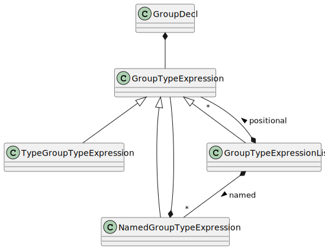

.. _sec_global_decl:

Global Declarations
===================

This section describes the classes that represent the 
global declarations of a Swan program: **const**, **type**, 
**sensor** and **group** constructs.

.. note::
    In Swan, a global declaration can contain several declarations. One can have 
    for instance: ``const C1: int32; C2: int32;`` or ``const C1: int32; const C2: int32;``.
    The Swan editor produces the second form, but having a list of declarations
    is correct.

.. currentmodule:: ansys.scadeone.core.swan

.. autoclass:: Declaration

.. autoclass:: GlobalDeclaration

Types
-----

.. autoclass:: TypeDeclarations

See also :doc:`type` for details on type definitions.

Constants
---------

.. autoclass:: ConstDecl

.. autoclass:: ConstDeclarations

Sensors
-------

.. autoclass:: SensorDecl

.. autoclass:: SensorDeclarations

.. _sec_group_decl:

Groups
------
A :py:class:`GroupDecl` object defines a **group** declaration, with a name and 
a :py:class:`GroupTypeExpression` for the type.

A :py:class:`GroupTypeExpression` can be:

- a type expression, represented by a :py:class:`TypeGroupTypeExpressionGroupType` instance
- or a list of :py:class:`GroupTypeExpression` items, decomposed into two lists:

  - a positional list of :py:class:`GroupTypeExpression` items
  - followed by a list of named :py:class:`GroupTypeExpression` items, represented
    with :py:class:`NamedGroupTypeExpression` instances.

.. autoclass:: GroupDecl

.. autoclass:: GroupTypeExpression

.. autoclass:: TypeGroupTypeExpression

.. autoclass:: NamedGroupTypeExpression

.. autoclass:: GroupTypeExpressionList

.. autoclass:: GroupDeclarations

Protected Declarations
----------------------

.. autoclass:: ProtectedDecl