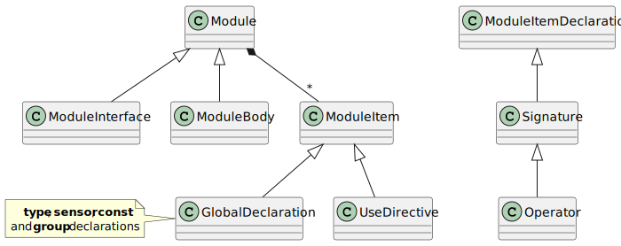

Modules and Interfaces
======================

.. currentmodule:: ansys.scadeone.core.swan

This section describes the classes that represent a module body
or a module interface. It also describes the class representing
a *use* directive which is used to reference a module/interface
in an other module/interface.

   

See also :ref:`ref_op_decl` and :ref:`ref_global_decl`.

.. .. autoclass:: Module

.. autoclass:: ModuleBody

.. autoclass:: ModuleInterface

.. autoclass:: UseDirective
