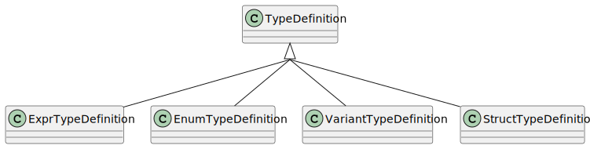

Type Declarations
=================

.. currentmodule:: ansys.scadeone.core.swan

A type declaration is a type name and its optional definition.
Type definitions are type expressions, enumerations, variants and structures.

.. autoclass:: TypeDecl

Type definitions
----------------

The class hierarchy of type definition is shown in the next figure:

  Type definitions class diagram

.. autoclass:: TypeDefinition

.. autoclass:: ExprTypeDefinition

Enumeration
~~~~~~~~~~~~

.. autoclass:: EnumTypeDefinition

Variant
~~~~~~~

A variant is represented by a :py:class:`VariantTypeDefinition` instance which contains
a list of :py:class:`VariantComponent` instances representing the variant cases:

- a simple tag
- a tag with a type expression
- a complex tag with a list of fields

.. autoclass:: VariantTypeDefinition

.. autoclass:: VariantComponent

.. autoclass:: VariantSimple

.. autoclass:: VariantTypeExpr

.. autoclass:: VariantStruct

Structures
~~~~~~~~~~

.. autoclass:: StructTypeDefinition

.. autoclass:: StructField

Type expressions
----------------

A type defined by a type expression has its definition stored as 
a :py:class:`ExprTypeDefinition` instance which contains the type expression
as a :py:class:`TypeExpression` instance. The :py:class:`TypeExpression` is the
base class for the type expressions given by the following figure:

.. figure:: _svg/type_expr.svg

  Type expressions class diagram

.. autoclass:: TypeExpression 

Predefined Types
~~~~~~~~~~~~~~~~

:py:class:`PredefinedType` class is the base class for the classes:

Signed integer types
  Int8Type, Int16Type, Int32Type, Int64Type

Unsigned integer types 
  Uint8Type, Uint16Type, Uint32Type, Uint64Type

Floating point types
  Float32Type, Float64Type

Other types
  BoolType, CharType

.. autoclass:: PredefinedType

Sized Types
~~~~~~~~~~~

Definition of types like ``T = signed<<42>>`` or ``T = unsigned<<42>>``.

.. autoclass:: SizedTypeExpression

Reference to Other Types and Generic Types
~~~~~~~~~~~~~~~~~~~~~~~~~~~~~~~~~~~~~~~~~~
.. autoclass:: TypeReferenceExpression

.. autoclass:: VariableTypeExpression

Arrays
~~~~~~

.. autoclass:: ArrayTypeExpression

Protected type expression
~~~~~~~~~~~~~~~~~~~~~~~~~

.. autoclass:: ProtectedTypeExpr
