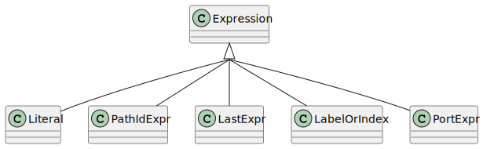

Identifiers and Atoms
=====================

This section details the atoms of expressions: identifiers, literals, ...

.. currentmodule:: ansys.scadeone.core.swan

    

Identifiers
-----------

.. autoclass:: PathIdExpr

.. autoclass:: PortExpr

.. autoclass:: LabelOrIndex

.. autoclass:: LastExpr

Literal
-------

.. autoclass:: Literal

.. autoclass:: LiteralKind

Patterns
--------

Patterns are used by :py:class:`CaseExpr` and :py:class:`ActivateWhen` classes
for the **case ... of** and **activate when** constructs.

.. autoclass:: Pattern

.. autoclass:: PathIdPattern
 
.. autoclass:: VariantPattern

.. autoclass:: CharPattern

.. autoclass:: BoolPattern

.. autoclass:: IntPattern

.. autoclass:: UnderscorePattern

.. autoclass:: DefaultPattern

.. autoclass:: ProtectedPattern
