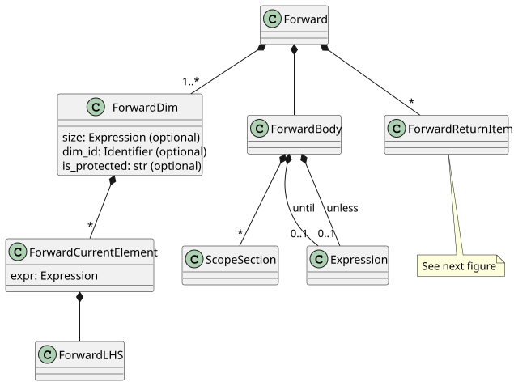
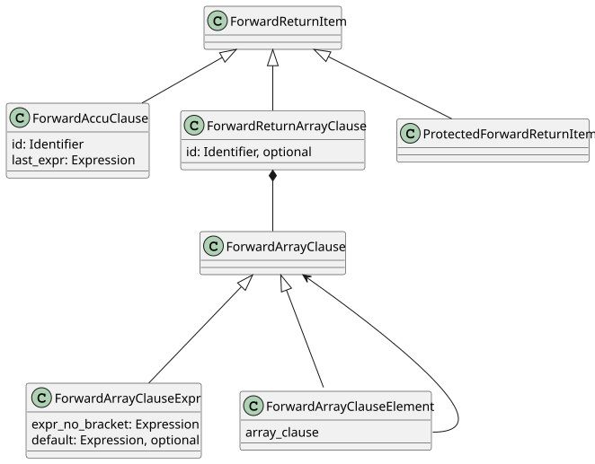

Forward expression
==================
 
.. currentmodule:: ansys.scadeone.core.swan

A **forward** expression is stored as a :py:class:`Forward` class. The class hierarchy is given in the following pictures:

    
    Forward class diagram

.. autoclass:: Forward

.. autoclass:: ForwardBody

Dimensions
----------

.. autoclass:: ForwardDim

.. autoclass:: ForwardCurrentElement

.. autoclass:: ForwardLHS

Forward returns
---------------

The base class for return *clause* is :py:class:`ForwardReturnItem`.
A syntactically incorrect return *clause* is represented by the 
:py:class:`ProtectedForwardReturnItem` class.

    
    Forward return

.. autoclass:: ForwardReturnItem

.. autoclass:: ProtectedForwardReturnItem

Accumulation
^^^^^^^^^^^^

Accumulation *clause* is represented by the :py:class:`ForwardAccuClause` class.

.. autoclass:: ForwardAccuClause

Array clause
^^^^^^^^^^^^ 

Returned array *clause* is represented by the :py:class:`ForwardReturnArrayClause` class,
which references a :py:class:`ForwardArrayClause` instance and its optional identifier.

.. autoclass:: ForwardReturnArrayClause

Array *clause* is either:

- a :py:class:`ForwardArrayClauseExpr` instance, or
- a :py:class:`ForwardArrayClauseElement` instance, which represents the ``[array_clause]``
  expression.

.. autoclass:: ForwardArrayClause

.. autoclass:: ForwardArrayClauseExpr

.. autoclass:: ForwardArrayClauseElement

