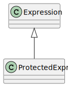

Expressions
===========

.. currentmodule:: ansys.scadeone.core.swan

Expressions are implemented with classes that have :py:class:`Expression` as top-level class.
Protected expressions are implemented as :py:class:`ProtectedExpr`.

Groups as defined in :ref:`sec_group` are also :py:class:`Expression`.

.. autoclass:: Expression

.. autoclass:: ProtectedExpr

.. toctree::
   :maxdepth: 2

   atom
   basic_expr
   composite
   selection
   sequential
   instance
   forward
