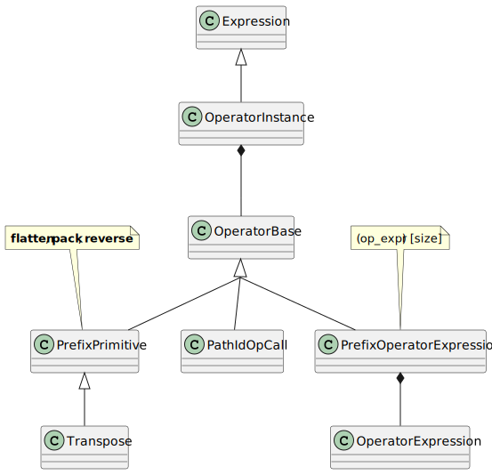
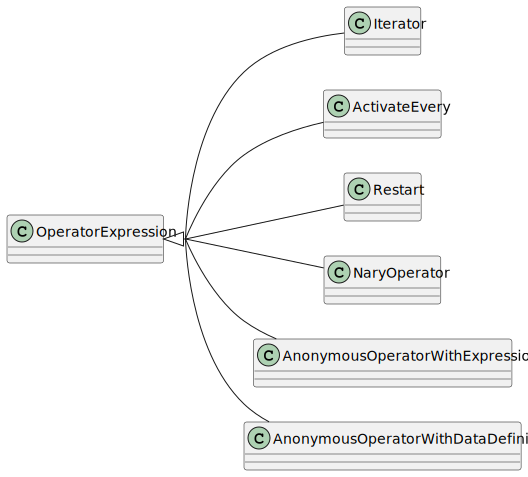

Operator Instance
=================

.. currentmodule:: ansys.scadeone.core.swan

An :py:class:`OperatorInstance` object is an :py:class:`Expression` object 
representing an operator instance call, the called operator being represented 
by an instance of the top-level class :py:class:`OperatorBase`

  Operator instance class diagram

Higher-order operations (operations using an operator as parameter) are 
represented by instances of the :py:class:`OperatorExpression` class.

  
  Operator higher-order class diagram

.. autoclass:: OperatorBase

Operator Instance Application
-----------------------------

.. autoclass:: OperatorInstance

Named Operator Instance
-----------------------

.. autoclass:: PathIdOpCall

Anonymous Operator Instance
---------------------------

.. autoclass:: AnonymousOperatorWithExpression

.. autoclass:: AnonymousOperatorWithDataDefinition

Higher-Order Operator Instance
------------------------------

.. list-table:: Higher-order operators 
    :header-rows: 1

    * - Higher-order
      - Application
    * - **map**, **fold**, **mapfold**, **mapi** **foldi**, **mapfoldi**
      - array iterators
    * - **activate** ... **every**
      - conditional activation
    * - **restart** ... **every**  
      - conditional restart
      

Iterator
^^^^^^^^

.. autoclass:: Iterator

.. autoclass:: IteratorKind

Activate
^^^^^^^^

.. autoclass:: ActivateEvery

Restart
^^^^^^^

.. autoclass:: Restart

Partial Operator Instance
-------------------------

.. autoclass:: Partial

.. autoclass:: OptGroupItem

N-Ary Operator Instance
-----------------------

N-ary operator instances are implemented as specific expressions. See :ref:`sec_n_ary_expr` section.

Operator Expressions
--------------------

.. autoclass:: OperatorExpression

.. autoclass:: PrefixOperatorExpression

This class is used when an operator expression is syntactically
incorrect and was protected by the serialization process.

.. autoclass:: ProtectedOpExpr

