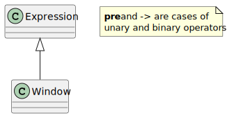

Sequential
==========

.. currentmodule:: ansys.scadeone.core.swan

.. list-table:: Sequential Operations
    :header-rows: 1

    * - Operator
      - Class
    * - **->** (Initial value)
      - See :py:class:`BinaryExpr`
    * - **pre** (Unit delay)
      - See :py:class:`UnaryExpr`
    * - **pre** (Initialized unit delay)
      - See :py:class:`BinaryExpr`
    * - **window** (Temporal window)
      - See :py:class:`Window`

  
.. autoclass:: Window