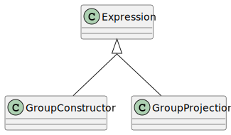

.. _ref_group:

Group
=====

.. currentmodule:: ansys.scadeone.core.swan

Groups can be declared using the **group** :ref:`declaration <ref_group_decl>`.

Groups are used either as a list of group items or as adaptation of an expression
may for groups.

    
    Group class diagram

Group Construction
------------------

Group constructor is : **(** *group* **)**. A *group* is itself a list of *group items*.

.. autoclass:: GroupConstructor

.. autoclass:: Group

.. autoclass:: GroupItem

Group Projection and Renamings
-------------------------------

A group projection accesses to fields in a group and returns a group
of the matching fields, using renamings.

The syntax is: *expr* **.(** *group_renamings* **)** where **.(** *group_renamings* **)** 
is a group adaptation, also used for :py:class:`Connection` in diagrams.

.. autoclass:: GroupProjection

.. autoclass:: GroupAdaptation

.. autoclass:: GroupRenaming

.. autoclass:: ProtectedGroupRenaming

