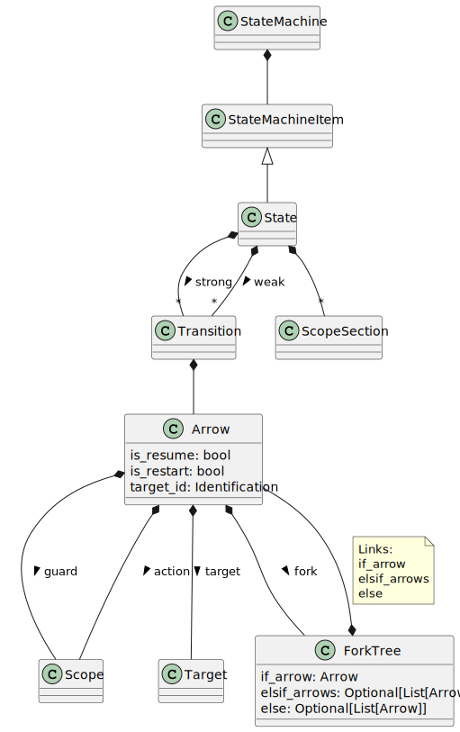

State machines
==============

.. currentmodule:: ansys.scadeone.core.swan

The Swan language has two syntax to express state machines:

- a state machine is a collection of states, each state having strong and weak transitions;
- a state machine is a collection of:

  - states, where states do not have transitions;
  - transition declarations, which describe the transitions as separate items.

A :py:class:`StateMachine` contains therefore a list of states and possibly transition declarations, all
as instances of :py:class:`StateMachineItem`.

The following figure shows the classes hierarchy when one uses states with transitions syntax. 

    
    States with transitions

The following figure shows the classes hierarchy when one uses states without transitions and
separate transition declaration syntax. 

.. figure:: states_and_transitions.svg

    States and transition declarations

.. note::

    Both representations are not exclusive, though it is not expected to have a mixed definition of
    a state machine with states and their transitions, and separate transitions.

.. autoclass:: StateMachine

.. autoclass:: StateMachineItem

States
------

.. autoclass:: State

.. autoclass:: StateRef

Transitions
-----------

.. autoclass:: TransitionDecl

.. autoclass:: Transition 

.. autoclass:: Arrow

.. autoclass:: Target

Forks
-----

Forks are transitions which split into several branches.

.. .. autoclass:: Fork

State with transitions
~~~~~~~~~~~~~~~~~~~~~~

A fork a succession of *if then else* with :py:class:`Arrow`.

.. autoclass:: ForkTree

Separate transitions
~~~~~~~~~~~~~~~~~~~~

Fork is a list of *if* and one *else* arrows with priorities.

.. autoclass:: ForkWithPriority

.. autoclass:: ForkPriorityList
