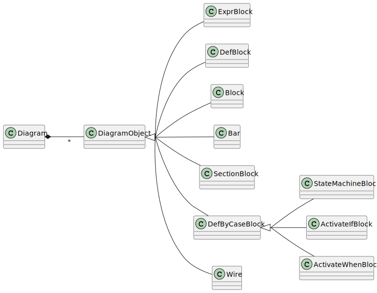

Diagrams
========

.. currentmodule:: ansys.scadeone.core.swan

A :py:class:`Diagram` object stores the representation of a **diagram**.
It contains the various blocks (see figure) and connections using
:py:class:`Wire` instances.  

    Diagram class diagram

.. autoclass:: Diagram
    :exclude-members: to_str

.. autoclass:: DiagramObject

Diagram Objects
---------------

This section describes the **expr**, **def** and **block** 
related classes.

.. autoclass:: ExprBlock

.. autoclass:: DefBlock

.. autoclass:: Block

Group/Ungroup block (*bar*)
---------------------------

The *bar* block is used to group/ungroup wires.

.. autoclass:: Bar

.. autoclass:: GroupOperation

Wire and Connections
--------------------

.. autoclass:: Wire

.. autoclass:: Connection

Def-by-case Blocks
------------------

The **def-by-case** blocks gather the graphical version of then state machine and
activate if/when constructs.

.. autoclass:: StateMachineBlock

.. autoclass:: ActivateIfBlock

.. autoclass:: ActivateWhenBlock

Sections
--------

The :py:class:`SectionBlock` contains a Swan *section*, that is
to say, a **let**, **var**, **diagram**, **assert**, **assume** or **guarantee** section.

.. autoclass:: SectionBlock

