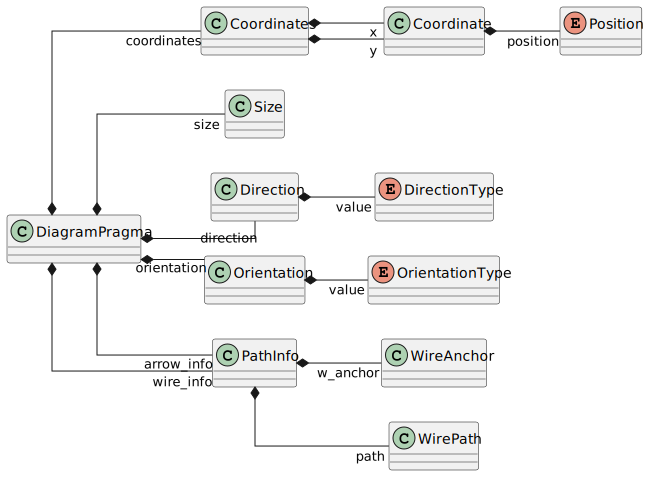

.. _sec_diag_pragmas:

Diagram Pragmas
===============

Graphical information is stored as *diagram pragmas* in the Swan source. This section describes the
diagram pragma classes.

A diagram pragma specifies layout information, which is represented as a JSON string within the pragma.
The exception is the ``detached`` pragma, which indicates that the diagram is hidden when specified as
``#pragma diagram detached #end``.

    DiagramPragma class diagram

.. currentmodule:: ansys.scadeone.core.swan

Diagram Pragma
--------------
.. autoclass:: DiagramPragma
     :exclude-members: to_str

Coordinates
-----------
Coordinates are used to define positions in the diagram. They represent a point with an absolute or relative position.
The :py:class:`Coordinates` class defines a point with its x and y coordinates. A :py:class:`Coordinate` 
represents a single coordinate, which can be absolute or relative depending on the :py:class:`Position` information. 
The letters "h" and "v" stand for horizontal and vertical positions, respectively, with capitalization indicating *absolute* or *relative* values.

Example: ``{"xy": "H100,V200"}`` specifies an absolute position at x=100 and y=200.

Relative values are computed from the center of the parent container. For wires and transitions, 
they correspond to the center of the source and target elements or the previous coordinate in the path.

.. autoclass:: Coordinates
     :exclude-members: to_str

.. autoclass:: Coordinate
     :exclude-members: to_str

.. autoclass:: Position

Size
----

.. autoclass:: Size
     :exclude-members: to_str

Direction
---------

The format is ``{"dir": "val"}``, where *val* is one of
 **ne**, **nw**, **es**, **en**, **se**, **sw**, **ws**, **wn**.
 For example, **ne** stands for "NorthEast," **nw** for "NorthWest," and so on.

The first letter represents the orientation of the top side of the block instance, 
while the second letter represents the orientation of its output side.
The default orientation is **ne**, with inputs on the left and outputs on the right.
A 90-degree clockwise rotation of the block instance results in a new orientation,
while a 90-degree counter-clockwise rotation combined with a flip results in the **ws** orientation.

.. autoclass:: Direction
     :exclude-members: to_str

.. autoclass:: DirectionType

Orientation
------------
.. autoclass:: Orientation
     :exclude-members: to_str

.. autoclass:: OrientationType

Wire and transition path
------------------------

Path information for a wire or transition is encapsulated within a :py:class:`PathInfo` object. 
This object includes a list of *moves* that define the path from the source element to the target element. 
Additionally, the path may contain multiple targets, which are represented as *branches* within the path structure.

The grammar for a path is as follows:

.. code-block:: text

     LUNUM = '#' [0-9]+
     COORD = [hHvV]+ '-'? [0-9]+ 

     path_info = path_anchor path
     path_anchor = LUNUM
                 | COORD '|' LUNUM
                 | coordinate '|' LUNUM
                 | coordinate
     path = moves path_anchor
          | moves branches
     moves =  move *
     move = COORD
          | coordinate
          | COORD '|' coordinate
          | coordinate '|' coordinate
     coordinate = COORD ',' COORD
     branches = '['' path ( ',' path ) * ']'

Where *path_info* is the path information, starting with a *path_anchor* and followed by a *path*. 
A *path* consists of a list of *moves* and ends with a *path_anchor* or *branches*.

COORD:
    Defines either an absolute or relative coordinate.

path_anchor:
     Defines the anchor of the path (source or target element), where:

     - LUNUM: source/target element number
     - COORD '|' LUNUM: connection to a group-related block
     - coordinate '|' LUNUM: connection to a state
     - coordinate: unconnected endpoint

moves:
     Moves are defined as:

     - COORD: a single move to the next coordinate, either horizontal or vertical
     - coordinate: move to a given point, which can be absolute or relative
     - coordinate '|' coordinate: move to a point (first coordinate) for a fork object (second coordinate)

Check the examples from the Scade One distribution to see pragma content and results.

Path information
^^^^^^^^^^^^^^^^

.. autoclass:: PathInfo
     :exclude-members: to_str

Path anchor
^^^^^^^^^^^ 
.. autoclass:: PathAnchor
     :exclude-members: to_str

Path moves
^^^^^^^^^^
.. autoclass:: Move
     :exclude-members: to_str

Path part
^^^^^^^^^ 
.. autoclass:: PathPart
     :exclude-members: to_str

Path branches
^^^^^^^^^^^^^

.. autoclass:: Branches
     :exclude-members: to_str
