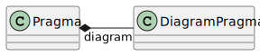

Pragma
======

.. currentmodule:: ansys.scadeone.core.swan

A :py:class:`Pragma` object stores a pragma information. It could save graphical information (:py:class:`DiagramPragma`)
and other data used by tools. The following figure depicts the :py:class:`Pragma` classes hierarchy.

   Pragma class diagram

.. autoclass:: Pragma
    :exclude-members: to_str
