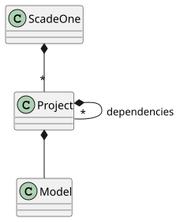

************
ScadeOne app
************

.. currentmodule:: ansys.scadeone.core

The :py:class:`ScadeOne` "app" is the Python class that allows to interact with Scade One projects. 

The **ansys.scadeone.core** module must be referenced by scripts using PyScadeOne. It exposes the :py:class:`ScadeOne` class representing a Scade One instance.

An instance of the :py:class:`ScadeOne` class gives access to project loading and model-related activities as shown in the next figure:

    
    ScadeOne class hierarchy
    
ScadeOne class
==============

.. autoclass:: ScadeOne
 

.. currentmodule:: ansys.scadeone.core.interfaces

Tools
----- 

The :py:meth:`ScadeOne.get_tool_path` method allows to retrieve the path of Scade One tools, 
such as the Job Launcher, which can be used to run Scade One jobs.

Available tools are given by the :py:class:`IScadeOne.Tool` enum.

.. autoclass:: IScadeOne
    :members: Tool
    :exclude-members: get_tool_path, install_dir
