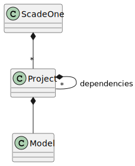

*************
Scade One API
*************

.. currentmodule:: ansys.scadeone.core

The :py:mod:`ansys.scadeone.core` module must be referenced by scripts using PyScadeOne. It exposes the :py:class:`ScadeOne` class representing a Scade One instance.

An instance of the :py:class:`ScadeOne` class gives access to project loading and model-related activities as shown in the next figure:

    
    ScadeOne class hierarchy
    
.. autoclass:: ScadeOne
 

