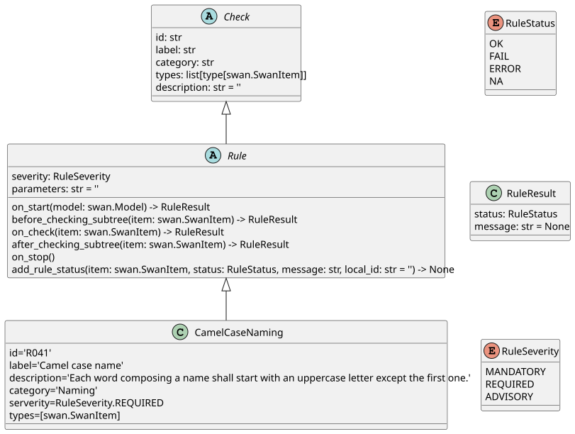

.. _ref_rules:

Rules checker
=============

.. currentmodule:: ansys.scadeone.core.svc.metrics_rules.rules

Rule checker is a tool that allows to check rules on a Scade One project. Using this tool, users can check their models
using predefined rules, but also create their own rules extending the base class :py:class:`Rule` implementing
the logic for checking certain conditions in a Scade One project.

The following diagram shows the key classes and relationships.

An example of how to define a rule using the base class :py:class:`Rule` is provided in the
:ref:`Rules checker example <ref_rules_example>` section.

API reference for these classes is provided below.

.. automodule:: ansys.scadeone.core.svc.metrics_rules.rules
    :member-order: bysource