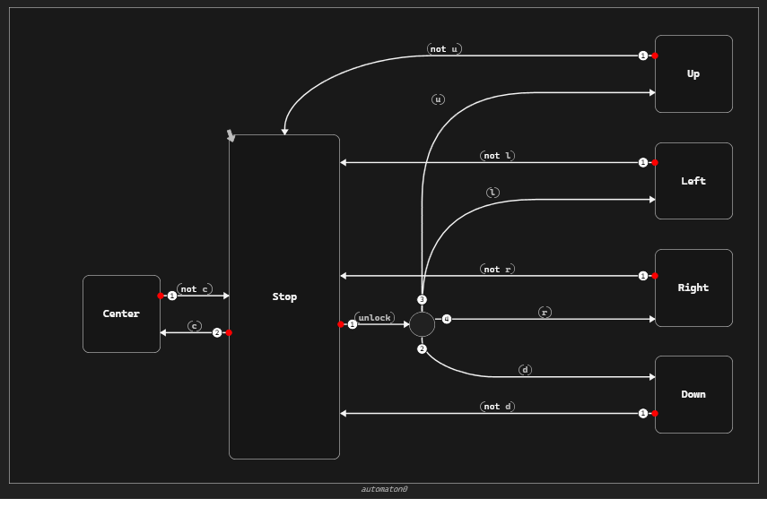

.. _ref_automaton_creator_ex:

Create automaton
==========================
This section illustrates how to create and populate automaton using the Python API.
One can start by creating a new project, an operator, a diagram, then automaton, states, transitions, forks with their branch transitions.

   
.. currentmodule:: ansys.scadeone.core

Create a new project
---------------------
Using the :py:class:`ScadeOne` class, one can create a new project:

.. literalinclude:: create_automaton.py
    :start-at: from ansys.scadeone.core
    :end-at: project = 

Once the project is created, add a new module:

.. literalinclude:: create_automaton.py
    :lines: 35

And an operator with its inputs in this module:

.. literalinclude:: create_automaton.py
    :lines: 38-44

.. currentmodule:: ansys.scadeone.core.swan

Create a new diagram
--------------------
Using the :py:class:`OperatorDefinition` class, add a new diagram to the operator previously created:

.. literalinclude:: create_automaton.py
    :lines: 47

Create a new automaton
----------------------
Automata can be created in the scope of :py:class:`Diagram` class.

.. literalinclude:: create_automaton.py
    :lines: 48

Populate an automaton
---------------------
The :py:class:`StateMachine` class offers the necessary methods to populate an automaton. The order of creation is important. For instance, states must be created before transitions, and transitions before forks.

Start by creating all automaton **states**:

.. literalinclude:: create_automaton.py
    :lines: 51-56

Once all states are created, **transitions** between them can be added:

.. literalinclude:: create_automaton.py
    :lines: 59-65

A **Fork** object can be created from one of the transitions previously created:

.. literalinclude:: create_automaton.py
    :lines: 68

This function returns the created fork as well as the default outgoing transition created in the same time.

Outgoing transition kind is the same as the transition requesting the fork creation (that is to say weak or strong).

Once the fork is created, additional branches can be added:

.. literalinclude:: create_automaton.py
    :lines: 69-71

.. note::
    Other forks can be created from any fork transition.

    .. literalinclude:: create_automaton.py
        :lines: 85-88

Finally, save the project, and look at the generated code:

.. literalinclude:: create_automaton.py
    :lines: 73-77

Complete example
----------------

This is the complete script presenting an automaton creation with its content.

.. literalinclude:: create_automaton.py
    :lines: 23-77

Overview
--------
In this example project, generated automaton looks like the following:

