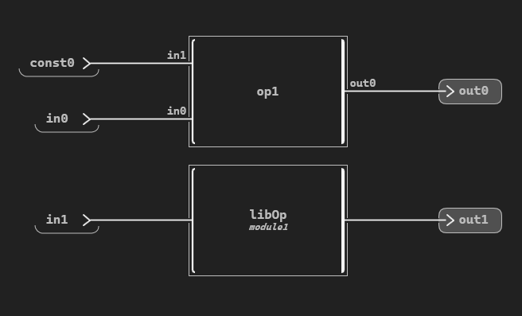

.. _creator_ex:

Create a Scade One project
==========================
This section presents how to create a Scade One project using the Python API.
You can start by creating a new project, then add modules, declarations, a diagram,
blocks, and connections between them.

.. note:: 
    Project dependencies have not supported yet. You should add the dependencies manually.
    
.. currentmodule:: ansys.scadeone.core

Create a new project
---------------------
Using the :py:class:`ScadeOne` class, you can create a new project:

.. literalinclude:: create_project.py
    :lines: 26-33

Once the project is created, you can add a new module interface:

.. literalinclude:: create_project.py
    :lines: 34

Also, you can add a new module:

.. literalinclude:: create_project.py
    :lines: 35

Namespace is also supported for creating new modules:

.. literalinclude:: create_project.py
    :lines: 36

In the new module, you can add a new declaration using the Scade One text syntax:

.. literalinclude:: create_project.py
    :lines: 38

.. currentmodule:: ansys.scadeone.core.swan

Also, a declaration can be added using the :py:class:`ModuleBody` or :py:class:`ModuleInterface`
*add_<declaration>()* methods.

For instance, to create a new constant, or new operators:

.. literalinclude:: create_project.py
    :lines: 39-40, 46

You can also add textual operators:

.. literalinclude:: create_project.py
    :lines: 54-61

Once an operator is added to the module, you can add inputs or outputs:

.. literalinclude:: create_project.py
    :lines: 42-43

.. currentmodule:: ansys.scadeone.core.svc.swan_creator

Inputs and outputs can be created using the :py:class:`ScadeOneFactory` class. They could be added using the
:py:meth:`append` or :py:meth:`extend` methods:

.. literalinclude:: create_project.py
    :lines: 49-50,52

You can also create operators including the inputs and outputs:

.. literalinclude:: create_project.py
    :lines: 63-65

A module can be used in another module:

.. literalinclude:: create_project.py
    :lines: 67

You can add a diagram, blocks, and connections between blocks to the operator,
as it is presented in the following diagram:

The corresponding code is:

.. literalinclude:: create_project.py
    :lines: 69-82

Finally, save the project:

.. literalinclude:: create_project.py
    :lines: 84
    
Complete example
----------------

This is the complete script presenting a Scade One model creation.

.. literalinclude:: create_project.py
    :lines: 23-88

