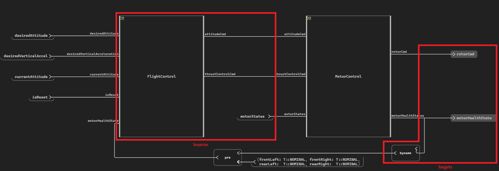
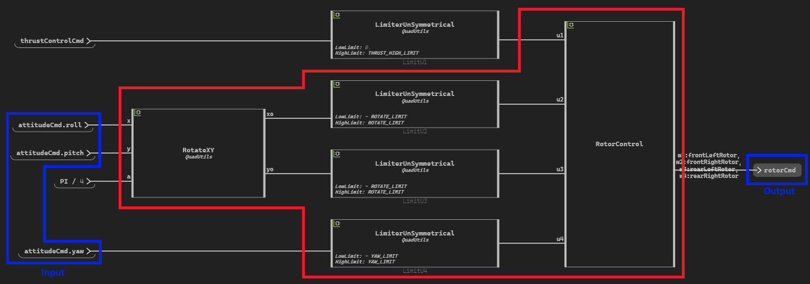

.. _diagram_nav_ex:

Diagram navigation
==================

This section presents navigation in an operator diagram, which means how to find the sources of an diagram block
(the blocks that are connected to its inputs) and the targets (the blocks that are connected to its outputs).

The section starts giving the basic methods to move through a diagram and finishes by a simple 
navigation between two objects using these methods.

The ``QuadFlightControl`` example is used. To setup the example see 
:ref:`ref_QuadFlightControl_python_setup`.

The operator is first retrieved from the module:

.. literalinclude:: quad_flight_control.py
    :lines: 40-48

Diagram block
-------------

The operator's diagram block can be accessed with the :py:attr:`ansys.scadeone.core.swan.Operator.diagrams` property.

.. literalinclude:: quad_flight_control.py
    :lines: 50

From the **MotorControl** diagram block, one can get the list of diagram objects (blocks, wires, etc.) and the
connections between them (sources or targets). The figure below presents those blocks for the example:

Diagram objects
---------------
To get the source and target objects, one need to get the diagram objects using the
:py:attr:`ansys.scadeone.core.swan.Diagram.objects` property. One can filter by :py:class:`ansys.scadeone.core.swan.Block`
to get the blocks list.

.. literalinclude:: quad_flight_control.py
    :lines: 53

Sources and targets
-------------------
Using the **MotorControl** diagram block, one can get the operator's sources using the
:py:attr:`ansys.scadeone.core.swan.DiagramObject.sources` property:

.. literalinclude:: quad_flight_control.py
    :lines: 55-61

One can also get the operator's targets using the
:py:attr:`ansys.scadeone.core.swan.DiagramObject.targets` property:

.. literalinclude:: quad_flight_control.py
    :lines: 63-64

Navigate from Input to Output
-----------------------------
One can navigate inside the **MotorControl** operator selecting a starting and an ending point.
One take **attitudeCmd** input as starting point and one navigate through the wires to get the blocks on the route
until one arrive at the ending point, **rotorCmd**.

First, one get the **attitudeCmd** input with its fields.

.. literalinclude:: quad_flight_control.py
    :lines: 105-114

Once one have the input, one can move to the next object diagram using
the :py:attr:`ansys.scadeone.core.swan.DiagramObject.targets` property.
For each object diagram target, one can move to the
next object, and so on until one arrive at the output. For each move, one can save the navigated object.

.. literalinclude:: quad_flight_control.py
    :lines: 117-130

Complete example
----------------

This is the complete script for the diagram navigation section, with print of results.

.. literalinclude:: quad_flight_control.py