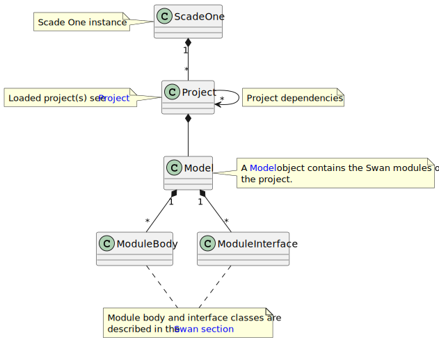

========
Overview
========

The PyScadeOne API is built around the :py:class:`ansys.scadeone.core.ScadeOne` class.
This class is the entry point to other APIs to manipulate project and Swan models.

Here is the class diagram showing the relationships between classes.

   
A *ScadeOne* instance is created as follows:

.. code:: python

   from ansys.scadeone.core import ScadeOne
   
   app = ScadeOne(install_dir="<Scade One installation dir>")
   project = app.load_project("project.sproj")

or it can be created using a context manager:

.. code:: python

   from ansys.scadeone.core import ScadeOne

   with ScadeOne(install_dir="<Scade One installation dir>") as app:
      project = app.load_project("project.sproj")

.. note::
   The ``install_dir`` parameter can be a ``str`` or a ``Path`` value.
   It is necessary to set it if the project relies on Scade One standard libraries.

PyScadeOne uses the **ScadeOneException** exception when an error occurs from the API.
Errors, warnings, etc. are logged into the `'pyscadeone.log` file located in the 
folder where the script is launched.

Check out section :ref:`ref_modeler` for more details. 
